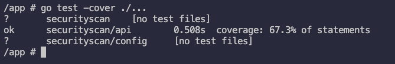

# Repository Scan API

## Overview

The Security Scan API is a web service that allows users to query and retrieve information about security vulnerabilities, that are already stored in JSON files in the given repository.

The API provides endpoints to filter and retrieve vulnerability data based on specific criteria, such as severity (the focus of this test). 

## Table of Contents  
- [Overview](#overview)  
- [Usage Instructions](#usage-instructions)  
  - [Managing the container](#managing-the-container)  
  - [Sending requests to the service](#sending-requests-to-the-service)  
- [Testing Instructions](#testing-instructions)  
- [Features](#features)  
- [Endpoints](#endpoints)  
  - [1. POST /scan](#1-post-scan)  
    - [Request Format](#request-format)  
    - [Response Format](#response-format)  
    - [Example Request Body](#example-request-body)  
  - [2. POST /query](#2-post-query)  
    - [Request Body Format](#request-body-format)  
    - [Example Request](#example-request)  
    - [Example Response](#example-response)  
- [Assumptions Made](#assumptions-made)  


## Usage Instructions

### Using the service

#### Managing the container
##### Start the service with:
```
docker compose up
```

##### Stop the service with:
```
docker compose down
```

###### To verify or access the database for testing purposes, attach a shell to the container and then run:
```
sqlite3 ./scans.db
```

#### Sending requests to the service

On the terminal, use the ``` curl ``` command to make HTTP requests to the service, or alternatively use Postman.

Here's an example for a request to the endpoint ```\scan```:
```
curl -X POST \
  http://localhost:8080/scan \
  -H 'Content-Type: application/json' \
  -d '{
    "repo": "https://github.com/velancio/vulnerability_scans",
    "files": [
        "vulnscan15.json"
    ]
}'
```

## Testing Instructions

Currently, the codebase has ~67% test coverage.

To test, run the below command in the attached shell of the docker container.

Navigate to ```\app``` in the container, or to the ```root``` folder if testing locally.

```
go test -coverprofile=coverage.out ./...
```

This will generate a ```coverage.out``` file which gives detailed information about the coverage.

Alternatively, run this command to get coverage details on the shell (terminal)
```
go test -cover ./...
```

After running either of the commands, it should look something like this.



## Features

This service lets you:
- Scan a GitHub repository for a set of requested files.
- Query scanned payloads, filter based on some attributes.

Stores the scanned payloads in a local sqlite3 database ```./scans.db```.

## Endpoints

### 1. POST /scan

Scans a (public, root) repository for all json files mentioned in the request and stores its payloads into an sqlite3 database.

Stores metadata like file name and time scanned along with the payloads in the file.

#### Request Format

``` json
curl -X POST \
  http://localhost:8080/scan \
  -H 'Content-Type: application/json' \
  -d '{
    "repo": "https://github.com/<repo_owner_username>/<repository_root>",
    "files": [
        "<filename1.json>",
        "<filename2.json>", ...
    ]
}'
```

#### Response Format

``` json
{
    "message":"Scan completed. Stored files successfully",
    "timestamp":<Datetime>
}
```

#### Example Request Body

```json
{
    "repo": "https://github.com/velancio/vulnerability_scans",
    "files": [
        "vulnscan15.json",
        "vulnscan16.json",
    ]
}
```


### 2. POST /query

Retrieves vulnerabilities based on the provided filters. This currently only implements filtering based on security. 

If no severity filter is provided, then all the records scanned will be returned.

#### Request Body Format

```
{
    "filters": {"severity": <severity>}
}
```

#### Example Request

```json
{
    "filters": {
        "severity": "HIGH"
    }
}
```

#### Example Response

```json
[
    {
        "id": "CVE-2024-1234",
        "severity": "HIGH",
        "cvss": 8.5,
        "status": "fixed",
        "package_name": "openssl",
        "current_version": "1.1.1t-r0",
        "fixed_version": "1.1.1u-r0",
        "description": "Buffer overflow vulnerability in OpenSSL",
        "published_date": "2024-01-15T00:00:00Z",
        "link": "https://nvd.nist.gov/vuln/detail/CVE-2024-1234",
        "risk_factors": [
            "Remote Code Execution",
            "High CVSS Score",
            "Public Exploit Available"
        ]
    },
    {
        "id": "CVE-2024-8902",
        "severity": "HIGH",
        "cvss": 8.2,
        "status": "fixed",
        "package_name": "openldap",
        "current_version": "2.4.57",
        "fixed_version": "2.4.58",
        "description": "Authentication bypass vulnerability in OpenLDAP",
        "published_date": "2024-01-21T00:00:00Z",
        "link": "https://nvd.nist.gov/vuln/detail/CVE-2024-8902",
        "risk_factors": [
            "Authentication Bypass",
            "High CVSS Score"
        ]
    }
]
```

## Assumptions Made

1. Assumes that the payload is the data inside 'vulnerabilities', as in the below snippet.

``` json
"vulnerabilities": [
        {
          "id": "CVE-2024-7701",
          "severity": "CRITICAL",
          "cvss": 9.1,
          "status": "active",
          "package_name": "postgresql",
          "current_version": "13.4",
          "fixed_version": "13.5",
          "description": "Buffer overflow in PostgreSQL database engine",
          "published_date": "2024-01-23T00:00:00Z",
          "link": "https://nvd.nist.gov/vuln/detail/CVE-2024-7701",
          "risk_factors": [
            "Buffer Overflow",
            "Remote Code Execution",
            "Critical CVSS Score"
          ]
        },
    ...]
```

2. Number of attempts for \scan assumed to be 2 attempts in total
```
"Error Handling: Retry failed GitHub API calls (2 attempts)."
I have implemented it as 1 attempt and 1 reattempt.
```

3. Assumes that each source file read from the GitHub repo doesn't contain duplicate CVEs

4. Parses the json payloads assuming the fields are same across any future json payloads scanned.


Note: This README was not AI-generated.
Authored by me, Aditi Killedar, February 2025.
